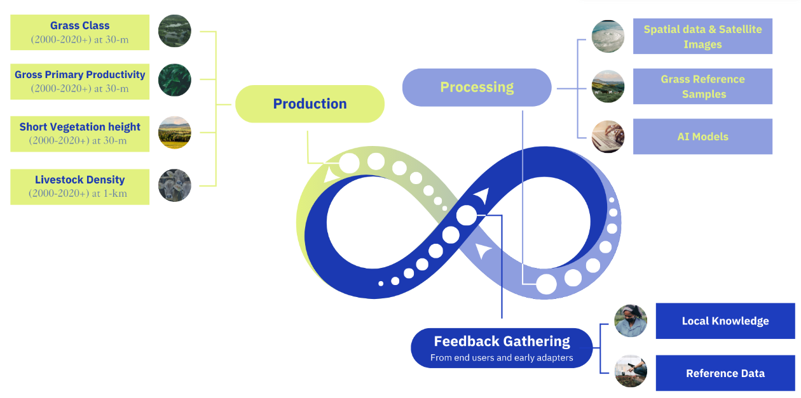

# Global Pasture Watch

This repository provides the source code used to produce the follow Global Pasture Watch products (2000–2022+):
* [GGC-30m: Global grassland class and extent maps at 30m](ggc-30m/README.md)
* [GLD-1km: Global livestock distributions maps at 1km](gld-1km/README.md)
* GSVH-30m: Global short vegetation height maps at 30m
* GGPP-30m: Global gross primary productivity maps at 30m

## Zenodo:

The output maps, reference samples, ML models and additional datasets are publicly available in Zenodo:

* **Global grassland class and extent maps at 30m**
	* [Annual grassland class and extent maps at 30-m spatial resolution (2000—2022)](https://doi.org/10.5281/zenodo.13890400)
  * [Grassland reference samples based on visual interpretation of VHR imagery (2000–2022)](https://zenodo.org/records/11281157)
  * [Global machine learning model for prediction of cultivated and natural/semi-natural grassland](https://zenodo.org/records/11280849)
  * [Grassland sampling design derived by Feature Space Coverage Sampling (FSCV) at 1-km spatial resolution](https://zenodo.org/records/11275539)
  * [Integrated Approach to Global Land Use and Land Cover Reference Data Harmonization](https://zenodo.org/records/11285561)
* **Global livestock distributions maps at 1km**
	* [Annual livestock headcount maps for cattle, goats, sheep and horses at 1-km 2000–2022 (FAOSTAT-adjusted)](https://doi.org/10.5281/zenodo.14933636)
	* [Annual cattle density maps at 1-km for 2000–2022 including prediction interval](https://doi.org/10.5281/zenodo.14933660)
	* [Annual goat density maps at 1-km for 2000–2022 including prediction interval](https://doi.org/10.5281/zenodo.14933653)
	* [Annual sheep density maps at 1-km for 2000–2022 including prediction interval](https://doi.org/10.5281/zenodo.14933641)
	* [Annual horse density maps at 1-km for 2000–2022 including prediction interval](https://doi.org/10.5281/zenodo.14933647)
	* [Livestock reference samples based on multi-source sub-national census data (2000—2022)](https://doi.org/10.5281/zenodo.14926056)
	* [Annual maps of potential land for livestock production at 1-km for 2000–2022](https://doi.org/10.5281/zenodo.14933679)

## STAC and Google Earth Engine

The output maps are also publicly available in Google Earth Engine and STAC:
* [Land & Carbon Lab Global Pasture Watch](https://developers.google.com/earth-engine/datasets/publisher/global-pasture-watch)
* [OpenLandMap STAC](https://stac.openlandmap.org)

## Related softwares / libraries

The softwares and libraries produced / maintained in the context of the initiative are publicly available:
* [QGIS Fast Grid Inspection](https://plugins.qgis.org/plugins/qgis-fgi-plugin/#plugin-about)
* [Scikit-Map](https://github.com/openlandmap/scikit-map)
* [Geo-Wiki](https://www.geo-wiki.org/)
* [LUCKINet](https://github.com/luckinet)

## Webinars:

The webinars organized by the initiative are publicly available: 

* [Global Pasture Watch: Mapping & Monitoring Global Grasslands and Livestock](https://www.wri.org/events/2023/4/global-pasture-watch-mapping-monitoring-global-grasslands-livestock)
* [Grassland Mapping & Monitoring: A Focus on Latin America](https://www.wri.org/events/2024/5/grassland-mapping-monitoring-focus-latin-america)

## Acknowledgements & Funding

This work is conducted by [WRI](https://wri.org), [OpenGeoHub Foundation](https://opengeohub.org/), [LAPIG/UFG](http://lapig.iesa.ufg.br), [IIASA](https://iiasa.ac.at/) and [iDiv](https://www.idiv.de/en/index.html) and has received funding from [Land and Carbon Lab](https://www.landcarbonlab.org/) through the [Global Pasture Watch](https://www.wri.org/events/2023/4/global-pasture-watch-mapping-monitoring-global-grasslands-livestock).