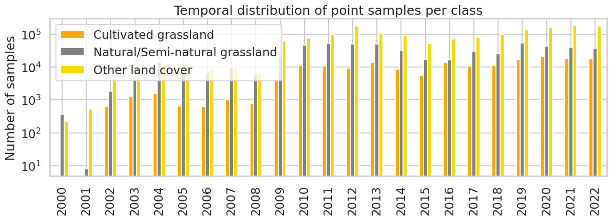
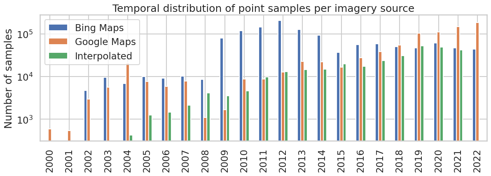
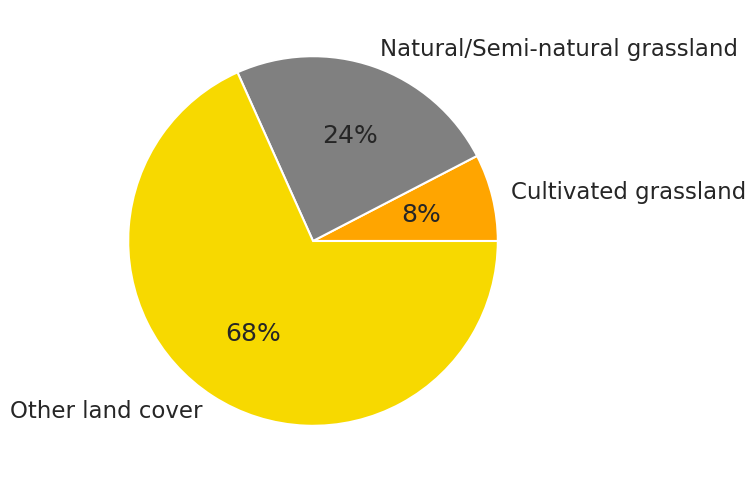
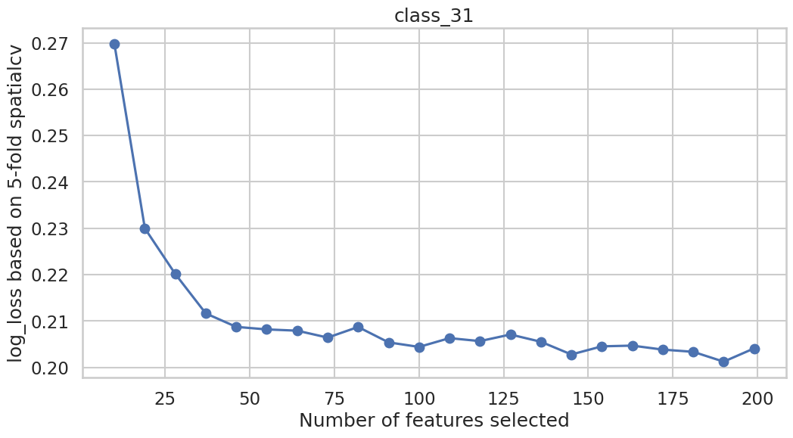
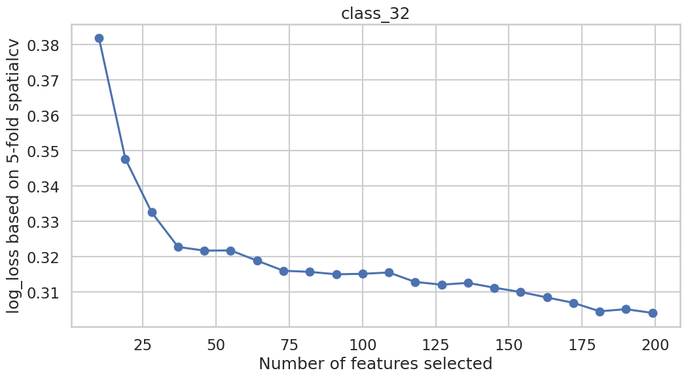
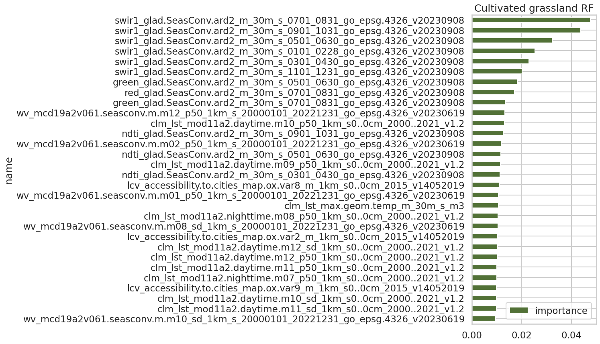
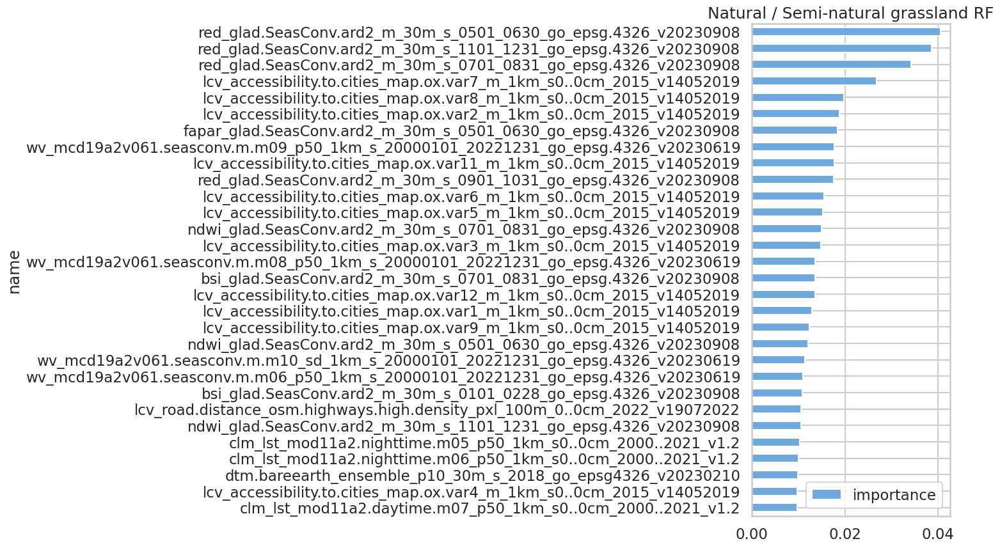
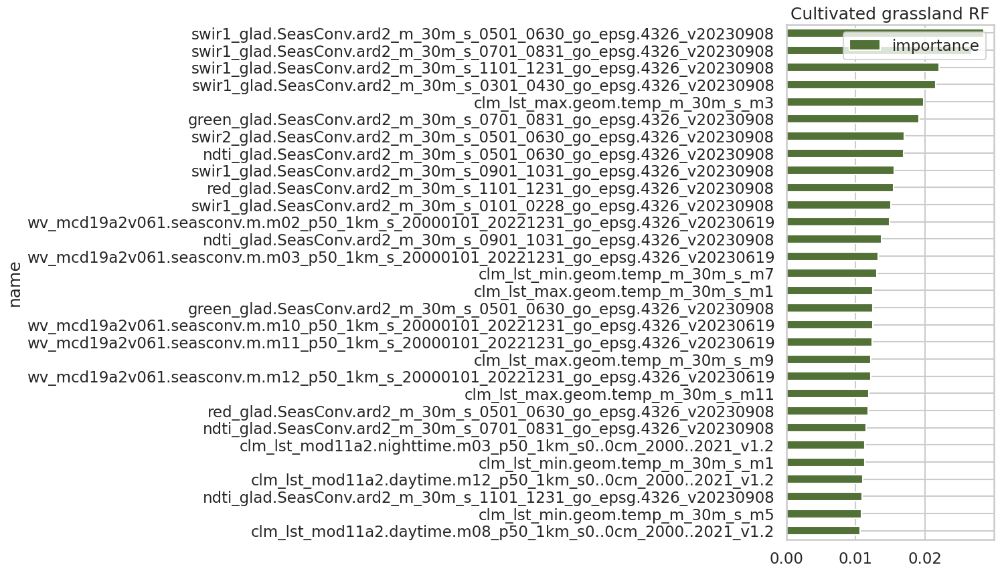
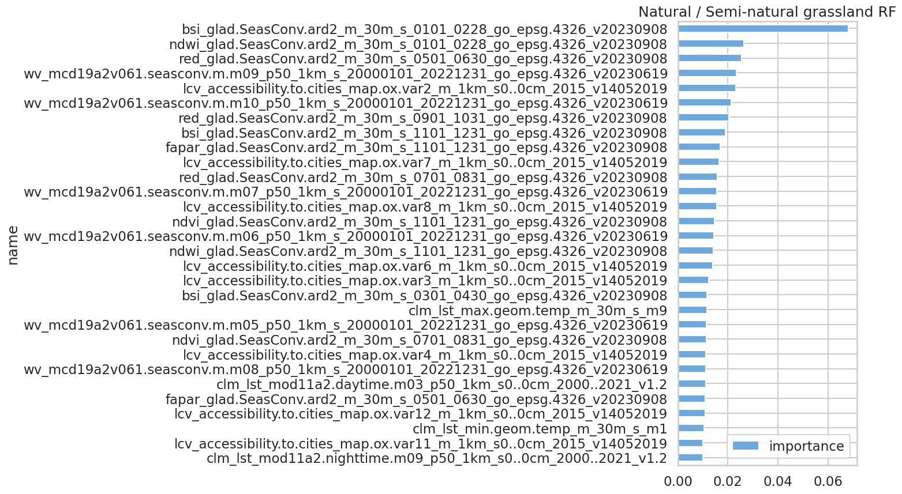

# Annual 30-m maps of global grassland class and extent (2000–2022) based on spatiotemporal Machine Learning

Computational notebook describing the machine learning modeling steps implemented for producing the global grassland maps (2000–2022), based on:

* Multiple Earth Observation (EO) data such as [GLAD Landsat ARD-2](https://glad.geog.umd.edu/ard/home), [MOD11A2](https://lpdaac.usgs.gov/products/mod11a2v006/), [MCD19A2](https://lpdaac.usgs.gov/products/mcd19a2v006/), digital terrain model derivatives and distance maps of accessibility, roads, and water;
* For model training, more than 2.3M reference samples were visually interpreted in Very High Resolution (VHR) images using [QGIS Fast Grid Inspection](https://plugins.qgis.org/plugins/qgis-fgi-plugin/#plugin-about);
* Two independent spatiotemporal Random Forest models were used to predict each grassland class (cultivated and natural/semi-natural) over multiple years on a global scale;
* The predictions were produced for all years from 2000 to 2022, resulting in a time series of global probability maps for each class at 30~m spatial resolution. 


The publication describing the scientific methodology is under revision ([pre-printing here](https://doi.org/10.21203/rs.3.rs-4514820/v3))

## Reference point samples

First, let's retrieve the reference point samples from [Zenodo](https://doi.org/10.5281/zenodo.13952806):


```python
import requests

zenodo_url = 'https://zenodo.org/records/13952806'
samples_fn = 'gpw_grassland_fscs.vi.vhr.overlaid_point.samples_20000101_20221231_go_epsg.4326_v1.pq'
samples_url = f'{zenodo_url}/files/{samples_fn}?download=1'

samples_req = requests.get(samples_url, allow_redirects=True)

print(f"Downloading {samples_fn}")
open(samples_fn, 'wb').write(samples_req.content)
```

    Downloading gpw_grassland_fscs.vi.vhr.overlaid_point.samples_20000101_20221231_go_epsg.4326_v1.pq


    664530175


The samples are organized in tabular structure and [parquet format](https://parquet.apache.org/), and [pandas](https://pandas.pydata.org/) can handle that: 


```python
import pandas as pd
samples = pd.read_parquet(samples_fn)
samples
```


<div>
<style scoped>
    .dataframe tbody tr th:only-of-type {
        vertical-align: middle;
    }

    .dataframe tbody tr th {
        vertical-align: top;
    }

    .dataframe thead th {
        text-align: right;
    }
</style>
<table border="1" class="dataframe">
  <thead>
    <tr style="text-align: right;">
      <th></th>
      <th>sample_id</th>
      <th>class</th>
      <th>class_label</th>
      <th>x</th>
      <th>y</th>
      <th>imagery</th>
      <th>ref_date</th>
      <th>year</th>
      <th>ml_cv_group</th>
      <th>ml_type</th>
      <th>...</th>
      <th>clm_lst_max.geom.temp_m_30m_s_m8</th>
      <th>clm_lst_min.geom.temp_m_30m_s_m8</th>
      <th>clm_lst_max.geom.temp_m_30m_s_m9</th>
      <th>clm_lst_min.geom.temp_m_30m_s_m9</th>
      <th>clm_lst_max.geom.temp_m_30m_s_m10</th>
      <th>clm_lst_min.geom.temp_m_30m_s_m10</th>
      <th>clm_lst_max.geom.temp_m_30m_s_m11</th>
      <th>clm_lst_min.geom.temp_m_30m_s_m11</th>
      <th>clm_lst_max.geom.temp_m_30m_s_m12</th>
      <th>clm_lst_min.geom.temp_m_30m_s_m12</th>
    </tr>
  </thead>
  <tbody>
    <tr>
      <th>0</th>
      <td>ee306b34a921c1ff345f6850683d9b43</td>
      <td>3</td>
      <td>Other land cover</td>
      <td>0.453821</td>
      <td>6.793882</td>
      <td>Bing</td>
      <td>2014-01-03</td>
      <td>2014</td>
      <td>gpw_8322</td>
      <td>train</td>
      <td>...</td>
      <td>3500.0</td>
      <td>2223.0</td>
      <td>3436.0</td>
      <td>2156.0</td>
      <td>3347.0</td>
      <td>2066.0</td>
      <td>3253.0</td>
      <td>1970.0</td>
      <td>3184.0</td>
      <td>1900.0</td>
    </tr>
    <tr>
      <th>2</th>
      <td>b36c15096000b1e1196d9353870fd4ab</td>
      <td>3</td>
      <td>Other land cover</td>
      <td>0.456321</td>
      <td>6.793882</td>
      <td>Bing</td>
      <td>2014-01-03</td>
      <td>2014</td>
      <td>gpw_8322</td>
      <td>train</td>
      <td>...</td>
      <td>3502.0</td>
      <td>2224.0</td>
      <td>3437.0</td>
      <td>2158.0</td>
      <td>3348.0</td>
      <td>2067.0</td>
      <td>3254.0</td>
      <td>1972.0</td>
      <td>3186.0</td>
      <td>1902.0</td>
    </tr>
    <tr>
      <th>3</th>
      <td>6030c825e5d3feee7efea315a9e8d5c6</td>
      <td>3</td>
      <td>Other land cover</td>
      <td>0.456821</td>
      <td>6.793882</td>
      <td>Bing</td>
      <td>2014-01-03</td>
      <td>2014</td>
      <td>gpw_8322</td>
      <td>train</td>
      <td>...</td>
      <td>3502.0</td>
      <td>2224.0</td>
      <td>3437.0</td>
      <td>2158.0</td>
      <td>3348.0</td>
      <td>2067.0</td>
      <td>3254.0</td>
      <td>1971.0</td>
      <td>3185.0</td>
      <td>1901.0</td>
    </tr>
    <tr>
      <th>4</th>
      <td>701a9eaa281fb0e612a72c754fde5a5c</td>
      <td>3</td>
      <td>Other land cover</td>
      <td>0.457321</td>
      <td>6.793882</td>
      <td>Bing</td>
      <td>2014-01-03</td>
      <td>2014</td>
      <td>gpw_8322</td>
      <td>train</td>
      <td>...</td>
      <td>3501.0</td>
      <td>2223.0</td>
      <td>3436.0</td>
      <td>2157.0</td>
      <td>3347.0</td>
      <td>2067.0</td>
      <td>3253.0</td>
      <td>1971.0</td>
      <td>3185.0</td>
      <td>1901.0</td>
    </tr>
    <tr>
      <th>6</th>
      <td>c9b53a070e273febef3ea4434029228f</td>
      <td>3</td>
      <td>Other land cover</td>
      <td>0.458321</td>
      <td>6.793882</td>
      <td>Bing</td>
      <td>2014-01-03</td>
      <td>2014</td>
      <td>gpw_8322</td>
      <td>train</td>
      <td>...</td>
      <td>3500.0</td>
      <td>2222.0</td>
      <td>3435.0</td>
      <td>2156.0</td>
      <td>3347.0</td>
      <td>2066.0</td>
      <td>3253.0</td>
      <td>1970.0</td>
      <td>3184.0</td>
      <td>1900.0</td>
    </tr>
    <tr>
      <th>...</th>
      <td>...</td>
      <td>...</td>
      <td>...</td>
      <td>...</td>
      <td>...</td>
      <td>...</td>
      <td>...</td>
      <td>...</td>
      <td>...</td>
      <td>...</td>
      <td>...</td>
      <td>...</td>
      <td>...</td>
      <td>...</td>
      <td>...</td>
      <td>...</td>
      <td>...</td>
      <td>...</td>
      <td>...</td>
      <td>...</td>
      <td>...</td>
    </tr>
    <tr>
      <th>1981122</th>
      <td>728134387c09acd3a3e4ebba5b0cb726</td>
      <td>3</td>
      <td>Other land cover</td>
      <td>126.159990</td>
      <td>8.939386</td>
      <td>Google</td>
      <td>2021-07-23</td>
      <td>2021</td>
      <td>gpw_9425</td>
      <td>calibration</td>
      <td>...</td>
      <td>3591.0</td>
      <td>2320.0</td>
      <td>3506.0</td>
      <td>2233.0</td>
      <td>3389.0</td>
      <td>2114.0</td>
      <td>3266.0</td>
      <td>1988.0</td>
      <td>3176.0</td>
      <td>1896.0</td>
    </tr>
    <tr>
      <th>1981195</th>
      <td>fd1203cd3654bd83ee86158dd7c27446</td>
      <td>3</td>
      <td>Other land cover</td>
      <td>126.163994</td>
      <td>8.937387</td>
      <td>Google</td>
      <td>2021-07-23</td>
      <td>2021</td>
      <td>gpw_9425</td>
      <td>calibration</td>
      <td>...</td>
      <td>3597.0</td>
      <td>2325.0</td>
      <td>3512.0</td>
      <td>2238.0</td>
      <td>3395.0</td>
      <td>2120.0</td>
      <td>3271.0</td>
      <td>1994.0</td>
      <td>3181.0</td>
      <td>1902.0</td>
    </tr>
    <tr>
      <th>1980973</th>
      <td>f5d89cd29bcdbc4f8dba5274320c2d9b</td>
      <td>3</td>
      <td>Other land cover</td>
      <td>126.159990</td>
      <td>8.943886</td>
      <td>Google</td>
      <td>2021-07-23</td>
      <td>2021</td>
      <td>gpw_9425</td>
      <td>calibration</td>
      <td>...</td>
      <td>3611.0</td>
      <td>2340.0</td>
      <td>3526.0</td>
      <td>2253.0</td>
      <td>3409.0</td>
      <td>2134.0</td>
      <td>3286.0</td>
      <td>2008.0</td>
      <td>3196.0</td>
      <td>1916.0</td>
    </tr>
    <tr>
      <th>1981192</th>
      <td>d363b691dcd1c5e170fa55ec79733028</td>
      <td>3</td>
      <td>Other land cover</td>
      <td>126.161490</td>
      <td>8.937387</td>
      <td>Google</td>
      <td>2021-07-23</td>
      <td>2021</td>
      <td>gpw_9425</td>
      <td>calibration</td>
      <td>...</td>
      <td>3597.0</td>
      <td>2325.0</td>
      <td>3511.0</td>
      <td>2238.0</td>
      <td>3395.0</td>
      <td>2119.0</td>
      <td>3271.0</td>
      <td>1994.0</td>
      <td>3181.0</td>
      <td>1902.0</td>
    </tr>
    <tr>
      <th>1981149</th>
      <td>93d4fd68e9e992177b91620262a8cd0d</td>
      <td>3</td>
      <td>Other land cover</td>
      <td>126.164990</td>
      <td>8.938886</td>
      <td>Google</td>
      <td>2021-07-23</td>
      <td>2021</td>
      <td>gpw_9425</td>
      <td>calibration</td>
      <td>...</td>
      <td>3596.0</td>
      <td>2324.0</td>
      <td>3510.0</td>
      <td>2237.0</td>
      <td>3394.0</td>
      <td>2118.0</td>
      <td>3270.0</td>
      <td>1993.0</td>
      <td>3180.0</td>
      <td>1901.0</td>
    </tr>
  </tbody>
</table>
<p>2353785 rows × 255 columns</p>
</div>


### Visualization

Let's visualize the grassland samples using [seaborn](https://seaborn.pydata.org/) and [matplotlib](https://matplotlib.org/stable/users/explain/colors/colormaps.html).


```python
import seaborn as sns
sns.set_theme(context='talk', style="whitegrid")
```

What is temporal distribution per class?


```python
import matplotlib.pyplot as plt
ax = samples[['year', 'class_label']].rename(columns={'class_label': 'Class'}).value_counts().unstack(fill_value=0).plot(kind='bar', xlabel='', ylabel='Number of samples', figsize=(14,4), logy=True, 
                                                                        color = ['orange','gray','#f7d900'], title='Temporal distribution of point samples per class')
ax.get_legend().set_title("")

# Export to PDF
#plt.savefig('point_samples_class.pdf', bbox_inches='tight')
```


    

    


And by imagery source?


```python
ax = samples[['year', 'imagery']].replace({"imagery": {'Google / Bing': 'Interpolated', 'Google': 'Google Maps', 'Bing': 'Bing Maps'}}).rename(columns={'imagery': 'Source'}).value_counts().unstack(fill_value=0).plot(kind='bar', xlabel='', ylabel='Number of samples', figsize=(14,4), logy=True,
title='Temporal distribution of point samples per imagery source')
ax.get_legend().set_title("")

# Export to PDF
#plt.savefig('point_samples_source.pdf', bbox_inches='tight')
```


    

    


What is the class proportion of all years?


```python
samples.groupby(['class_label']).count().plot(kind='pie', y='class', ylabel='', autopct='%1.0f%%', figsize=(6,6), colors = ['orange','gray','#f7d900'], legend=False)
```


    <Axes: >


    

    


```python
from pathlib import Path
import multiprocessing
import sys

from scipy.signal import argrelmin
from scipy.stats import uniform, randint

from sklearn import metrics
from sklearn.datasets import make_classification
from sklearn.ensemble import RandomForestClassifier
from sklearn.ensemble import RandomForestClassifier, ExtraTreesClassifier
from sklearn.experimental import enable_halving_search_cv 
from sklearn.feature_selection import RFECV, RFE
from sklearn.linear_model import LogisticRegression
from sklearn.metrics import ConfusionMatrixDisplay, classification_report
from sklearn.metrics import log_loss
from sklearn.model_selection import GroupKFold, KFold
from sklearn.model_selection import HalvingRandomSearchCV
from sklearn.pipeline import Pipeline
from sklearn.preprocessing import LabelEncoder
from sklearn.preprocessing import StandardScaler

import xgboost as xgb

import joblib

import numpy as np
import pandas as pd
```

### Columns selection

Before modeling, it is necessary to define the columns that will serve as: 
- Input feature/covariates 
- Spatial/blocking cross-validation group (see [GroupKFold](https://scikit-learn.org/stable/modules/generated/sklearn.model_selection.GroupKFold.html#sklearn.model_selection.GroupKFold))


```python
import numpy as np

# Input features/covariates
cov_idx = list(samples.columns).index('ml_type') + 1
covs = samples.columns[cov_idx:]

# Subset of relevant input features/covariates 
covs = covs[np.logical_or.reduce([
    covs.str.contains('accessibility'),
    covs.str.contains('blue'),
    covs.str.contains('bsf'),
    covs.str.contains('bsi'),
    covs.str.contains('clm'),
    covs.str.contains('dtm'),
    covs.str.contains('evi'),
    covs.str.contains('fapar'),
    covs.str.contains('green'),
    covs.str.contains('ndti'),
    covs.str.contains('ndvi'),
    covs.str.contains('ndwi'),
    covs.str.contains('nir'),
    covs.str.contains('nirv'),
    covs.str.contains('red'),
    covs.str.contains('road.distance_osm.highways.high.density'),
    covs.str.contains('road.distance_osm.highways.low.density'),
    covs.str.contains('swir1'),
    covs.str.contains('swir2'),
    covs.str.contains('thermal'),
    covs.str.contains('water.distance_glad.interanual.dynamic.classes'),
    covs.str.contains('wv_mcd19a2v061')
])]

# spatial/blocking CV group 
spatial_cv_column = 'ml_cv_group'

# Number of cv fold
cv_njobs, cv_folds = 5, 5

# Fixed seed for enabling reproducibility of the results
seed = 1989

print(f"Total number of input features/covariates: {len(covs)}")
```

    Total number of input features/covariates: 197


### One-vs-one multi-class split

Aiming to enable modeling the grassland classes separately, which consists in training one model specialized in cultivated (binary classifier of cultivated grassland vs other land cover) and ) and another model specialized in natural/semi-natural grassland (binary classifier of natural/semi-natural grassland vs other land cover), we need to implement spit the labels (`class` column) by a [one-vs-one (ovo) multi-class strategy](https://machinelearningmastery.com/one-vs-rest-and-one-vs-one-for-multi-class-classification/).

Let's take a look the class labels


```python
target_column = 'class'
samples[[target, 'class_label']].value_counts()
```


    class  class_label                   
    3      Other land cover                  1607555
    2      Natural/Semi-natural grassland     566937
    1      Cultivated grassland               179293
    Name: count, dtype: int64


... and run the ovo split for cultivated grassland vs other land cover (`3 & 1`, other land cover as zero) and natural/semi-natural grassland vs other land cover (`3 & 2`, other land cover as zero):


```python
def target_ovo(samples, target_column, c1_val, c2_val):
    remap_dict = {}
    remap_dict[c1_val] = 0
    remap_dict[c2_val] = 1
    col = f'{target_column}_{c1_val}{c2_val}'
    samples[col] = samples[target_column].map(remap_dict)
    return col

target_cols = []

for c1_val, c2_val in [ (3,1), (3,2)]:
    col_ovo = target_ovo(samples, target_column, c1_val, c2_val)
    target_cols.append(col_ovo)

print("OVO columns:", target_cols)
```

    OVO columns: ['class_31', 'class_32']


```python
samples
```


<div>
<style scoped>
    .dataframe tbody tr th:only-of-type {
        vertical-align: middle;
    }

    .dataframe tbody tr th {
        vertical-align: top;
    }

    .dataframe thead th {
        text-align: right;
    }
</style>
<table border="1" class="dataframe">
  <thead>
    <tr style="text-align: right;">
      <th></th>
      <th>sample_id</th>
      <th>class</th>
      <th>class_label</th>
      <th>x</th>
      <th>y</th>
      <th>imagery</th>
      <th>ref_date</th>
      <th>year</th>
      <th>ml_cv_group</th>
      <th>ml_type</th>
      <th>...</th>
      <th>clm_lst_max.geom.temp_m_30m_s_m9</th>
      <th>clm_lst_min.geom.temp_m_30m_s_m9</th>
      <th>clm_lst_max.geom.temp_m_30m_s_m10</th>
      <th>clm_lst_min.geom.temp_m_30m_s_m10</th>
      <th>clm_lst_max.geom.temp_m_30m_s_m11</th>
      <th>clm_lst_min.geom.temp_m_30m_s_m11</th>
      <th>clm_lst_max.geom.temp_m_30m_s_m12</th>
      <th>clm_lst_min.geom.temp_m_30m_s_m12</th>
      <th>class_31</th>
      <th>class_32</th>
    </tr>
  </thead>
  <tbody>
    <tr>
      <th>0</th>
      <td>ee306b34a921c1ff345f6850683d9b43</td>
      <td>3</td>
      <td>Other land cover</td>
      <td>0.453821</td>
      <td>6.793882</td>
      <td>Bing</td>
      <td>2014-01-03</td>
      <td>2014</td>
      <td>gpw_8322</td>
      <td>train</td>
      <td>...</td>
      <td>3436.0</td>
      <td>2156.0</td>
      <td>3347.0</td>
      <td>2066.0</td>
      <td>3253.0</td>
      <td>1970.0</td>
      <td>3184.0</td>
      <td>1900.0</td>
      <td>0.0</td>
      <td>0.0</td>
    </tr>
    <tr>
      <th>2</th>
      <td>b36c15096000b1e1196d9353870fd4ab</td>
      <td>3</td>
      <td>Other land cover</td>
      <td>0.456321</td>
      <td>6.793882</td>
      <td>Bing</td>
      <td>2014-01-03</td>
      <td>2014</td>
      <td>gpw_8322</td>
      <td>train</td>
      <td>...</td>
      <td>3437.0</td>
      <td>2158.0</td>
      <td>3348.0</td>
      <td>2067.0</td>
      <td>3254.0</td>
      <td>1972.0</td>
      <td>3186.0</td>
      <td>1902.0</td>
      <td>0.0</td>
      <td>0.0</td>
    </tr>
    <tr>
      <th>3</th>
      <td>6030c825e5d3feee7efea315a9e8d5c6</td>
      <td>3</td>
      <td>Other land cover</td>
      <td>0.456821</td>
      <td>6.793882</td>
      <td>Bing</td>
      <td>2014-01-03</td>
      <td>2014</td>
      <td>gpw_8322</td>
      <td>train</td>
      <td>...</td>
      <td>3437.0</td>
      <td>2158.0</td>
      <td>3348.0</td>
      <td>2067.0</td>
      <td>3254.0</td>
      <td>1971.0</td>
      <td>3185.0</td>
      <td>1901.0</td>
      <td>0.0</td>
      <td>0.0</td>
    </tr>
    <tr>
      <th>4</th>
      <td>701a9eaa281fb0e612a72c754fde5a5c</td>
      <td>3</td>
      <td>Other land cover</td>
      <td>0.457321</td>
      <td>6.793882</td>
      <td>Bing</td>
      <td>2014-01-03</td>
      <td>2014</td>
      <td>gpw_8322</td>
      <td>train</td>
      <td>...</td>
      <td>3436.0</td>
      <td>2157.0</td>
      <td>3347.0</td>
      <td>2067.0</td>
      <td>3253.0</td>
      <td>1971.0</td>
      <td>3185.0</td>
      <td>1901.0</td>
      <td>0.0</td>
      <td>0.0</td>
    </tr>
    <tr>
      <th>6</th>
      <td>c9b53a070e273febef3ea4434029228f</td>
      <td>3</td>
      <td>Other land cover</td>
      <td>0.458321</td>
      <td>6.793882</td>
      <td>Bing</td>
      <td>2014-01-03</td>
      <td>2014</td>
      <td>gpw_8322</td>
      <td>train</td>
      <td>...</td>
      <td>3435.0</td>
      <td>2156.0</td>
      <td>3347.0</td>
      <td>2066.0</td>
      <td>3253.0</td>
      <td>1970.0</td>
      <td>3184.0</td>
      <td>1900.0</td>
      <td>0.0</td>
      <td>0.0</td>
    </tr>
    <tr>
      <th>...</th>
      <td>...</td>
      <td>...</td>
      <td>...</td>
      <td>...</td>
      <td>...</td>
      <td>...</td>
      <td>...</td>
      <td>...</td>
      <td>...</td>
      <td>...</td>
      <td>...</td>
      <td>...</td>
      <td>...</td>
      <td>...</td>
      <td>...</td>
      <td>...</td>
      <td>...</td>
      <td>...</td>
      <td>...</td>
      <td>...</td>
      <td>...</td>
    </tr>
    <tr>
      <th>1981122</th>
      <td>728134387c09acd3a3e4ebba5b0cb726</td>
      <td>3</td>
      <td>Other land cover</td>
      <td>126.159990</td>
      <td>8.939386</td>
      <td>Google</td>
      <td>2021-07-23</td>
      <td>2021</td>
      <td>gpw_9425</td>
      <td>calibration</td>
      <td>...</td>
      <td>3506.0</td>
      <td>2233.0</td>
      <td>3389.0</td>
      <td>2114.0</td>
      <td>3266.0</td>
      <td>1988.0</td>
      <td>3176.0</td>
      <td>1896.0</td>
      <td>0.0</td>
      <td>0.0</td>
    </tr>
    <tr>
      <th>1981195</th>
      <td>fd1203cd3654bd83ee86158dd7c27446</td>
      <td>3</td>
      <td>Other land cover</td>
      <td>126.163994</td>
      <td>8.937387</td>
      <td>Google</td>
      <td>2021-07-23</td>
      <td>2021</td>
      <td>gpw_9425</td>
      <td>calibration</td>
      <td>...</td>
      <td>3512.0</td>
      <td>2238.0</td>
      <td>3395.0</td>
      <td>2120.0</td>
      <td>3271.0</td>
      <td>1994.0</td>
      <td>3181.0</td>
      <td>1902.0</td>
      <td>0.0</td>
      <td>0.0</td>
    </tr>
    <tr>
      <th>1980973</th>
      <td>f5d89cd29bcdbc4f8dba5274320c2d9b</td>
      <td>3</td>
      <td>Other land cover</td>
      <td>126.159990</td>
      <td>8.943886</td>
      <td>Google</td>
      <td>2021-07-23</td>
      <td>2021</td>
      <td>gpw_9425</td>
      <td>calibration</td>
      <td>...</td>
      <td>3526.0</td>
      <td>2253.0</td>
      <td>3409.0</td>
      <td>2134.0</td>
      <td>3286.0</td>
      <td>2008.0</td>
      <td>3196.0</td>
      <td>1916.0</td>
      <td>0.0</td>
      <td>0.0</td>
    </tr>
    <tr>
      <th>1981192</th>
      <td>d363b691dcd1c5e170fa55ec79733028</td>
      <td>3</td>
      <td>Other land cover</td>
      <td>126.161490</td>
      <td>8.937387</td>
      <td>Google</td>
      <td>2021-07-23</td>
      <td>2021</td>
      <td>gpw_9425</td>
      <td>calibration</td>
      <td>...</td>
      <td>3511.0</td>
      <td>2238.0</td>
      <td>3395.0</td>
      <td>2119.0</td>
      <td>3271.0</td>
      <td>1994.0</td>
      <td>3181.0</td>
      <td>1902.0</td>
      <td>0.0</td>
      <td>0.0</td>
    </tr>
    <tr>
      <th>1981149</th>
      <td>93d4fd68e9e992177b91620262a8cd0d</td>
      <td>3</td>
      <td>Other land cover</td>
      <td>126.164990</td>
      <td>8.938886</td>
      <td>Google</td>
      <td>2021-07-23</td>
      <td>2021</td>
      <td>gpw_9425</td>
      <td>calibration</td>
      <td>...</td>
      <td>3510.0</td>
      <td>2237.0</td>
      <td>3394.0</td>
      <td>2118.0</td>
      <td>3270.0</td>
      <td>1993.0</td>
      <td>3180.0</td>
      <td>1901.0</td>
      <td>0.0</td>
      <td>0.0</td>
    </tr>
  </tbody>
</table>
<p>2353785 rows × 257 columns</p>
</div>


### NA checking

Let's make sure that there now `NA`s (represented as `np.nan` in [numpy](https://numpy.org/)) in the input features/covariates


```python
any_nan_samples = np.sum(np.isnan(samples[covs].to_numpy()).astype('int'), axis=0)
cols_to_remove = []

for th in [1, 0.5, 0.2, 0.1, 0.05]:
    print(f"Checking columns with {th*100}% of nan values")
    for c,s in zip(covs, any_nan_samples):
        if s > (samples.shape[0] * th):
            print(f' - {s} => {c}')
            cols_to_remove += [c]

cols_to_remove = set(cols_to_remove)
print(f"Removing {len(cols_to_remove)} columns (>= {th*100}% of nan values)")
```

    Checking columns with 100% of nan values
    Checking columns with 50.0% of nan values
    Checking columns with 20.0% of nan values
    Checking columns with 10.0% of nan values
    Checking columns with 5.0% of nan values
    Removing 0 columns (>= 5.0% of nan values)


neither in the sample rows:


```python
nan_samples = samples[np.any(np.isnan(samples[covs].to_numpy()).astype('int'), axis=1)].index
print(f"Removing {len(nan_samples)} samples with at least one column with nan")
samples = samples.drop(nan_samples)
```

    Removing 0 samples with at least one column with nan


## ML modeling

For the ML modeling the samples need to be split in calibration and training set, in our case `10%` and `90%`, respectively. The calibration samples will be used for **feature selection** and **hyper-parameter tuning**.

Let's use the column `ml_type` for spit the samples:


```python
data_calib = samples[samples['ml_type'] == 'calibration']
data_train = samples[samples['ml_type'] == 'train']

print(f"Calibration samples: {data_calib.shape}")
print(f"Training samples: {data_train.shape}")
```

    Calibration samples: (231428, 257)
    Training samples: (2122357, 257)


### Feature selection

The first step of our ML modeling is the feature selection based on [Recursive Feature Elimination (RFE)](https://doi.org/10.3390/rs12111842) and implemented in sckit-learn by [RFECV](https://scikit-learn.org/dev/modules/generated/sklearn.feature_selection.RFECV.html) and [RFE](https://scikit-learn.org/dev/modules/generated/sklearn.feature_selection.RFE.html) classes. 

Let's considering [RandomForest](https://scikit-learn.org/dev/modules/generated/sklearn.ensemble.RandomForestClassifier.html) (60 trees and default hyper-parameters) for running RFE and find the best **75 features** to classify each grassland class separately. It's a good practice to run RFE cross-valitation  (RFECV) for understanding what is the impact in the model accuracy of dropping the number features. We selected [log_loss](https://scikit-learn.org/stable/modules/generated/sklearn.metrics.log_loss.html) (suitable for probability assessment) as scoring metric of our RFECV, which was repeated 5 times and averaged to derive the final scoring values.


```python
from sklearn.ensemble import RandomForestClassifier
from sklearn.model_selection import GroupKFold, KFold
from sklearn.feature_selection import RFECV, RFE
from scipy.signal import argrelmin
import multiprocessing

def run_feature_selection(data, covs, target_column, seed, weights=None, spatial_cv_column = None,
                          subsample_pct = 0.1, n_rep = 5, n_cv = 5, ntrees = 60, local_min_pos = 0, order=2):

    # Feature selection using the full set of calibration samples
    data_sub = data
    
    # Feature selection using a subset of calibration samples
    # data_sub = data#.sample(int(data.shape[0] * subsample_pct), random_state=seed)
    
    rfecv_step = int(len(covs) * 0.05)
    rfe_step = int(rfecv_step / 2)
    
    cv, groups = KFold(n_cv), None
    if spatial_cv_column is not None:
        cv, groups = GroupKFold(n_cv), data[spatial_cv_column]
    
    ncpu = multiprocessing.cpu_count()
    if ntrees < ncpu:
        ncpu = ntrees

    ttprint(f"Finding n_features_to_select using RFECV (repetitions={n_rep} step={rfecv_step}, n_samples={data.shape[0]})")
    
    grid_scores = []
    for i in range(0,n_rep):
        ttprint(f"Repetition {i}")
        rfecv = RFECV(estimator=RandomForestClassifier(ntrees, n_jobs=ncpu, random_state=i), cv=cv, step=rfecv_step, 
                      min_features_to_select=10, n_jobs=n_cv, scoring='neg_log_loss')
        rfecv.fit(data[covs], data[target_column], groups=groups)
        grid_scores += [rfecv.cv_results_['mean_test_score']]

    rfecv_mean_score = np.mean(np.stack(grid_scores, axis=0), axis=0)
    grid_scores_std = np.std(np.stack(grid_scores, axis=0), axis=0)
    
    rfecv_n_features_arr = list(range(rfecv.min_features_to_select, len(covs)+rfecv.step, rfecv.step))
    
    # Select automatically n_features_to_select according to the local minimum
    #local_min_arr = argrelmin(rfecv_mean_score, order=order)[0]
    #local_min = local_min_arr[0]
    #if len(local_min_arr) > 1:
    #    local_min = local_min_arr[local_min_pos]
    
    #n_features_to_select = rfecv_n_features_arr[local_min]
    
    # Fixed n_features_to_select considering 38% of the total number of features
    n_features_to_select = 75
    
    ttprint(f"Finding best features using RFE (n_features_to_select = {n_features_to_select})")
    
    rfe = RFE(estimator=RandomForestClassifier(ntrees, n_jobs=ncpu, random_state=n_rep), step=rfe_step, n_features_to_select=n_features_to_select, verbose=1)
    rfe.fit(data[covs], data[target_column])

    result = covs[rfe.support_]
    
    return result, rfecv_n_features_arr, rfecv_mean_score, grid_scores_std
```

Let's run the feature selection and save the results using [joblib](https://joblib.readthedocs.io/en/stable/). This might take some hours, so it is time for a coffee :)


```python
from pathlib import Path
import joblib

for tc in target_cols:
    fn_rfcv = f'rfecv_{tc}.lz4' 
    if not Path(fn_rfcv).exists():
        ttprint(f"Finding best features for {tc}")
        data_calib_mask = np.logical_not(np.isnan(data_calib[tc]))
        covs_rfe, rfecv_n_features_arr, rfecv_mean_score, rfecv_std_score = run_feature_selection(
            data_calib[data_calib_mask], covs, tc, seed, weights=None, spatial_cv_column, local_min_pos=0)
        joblib.dump({
            'covs_rfe':covs_rfe, 
            'rfecv_n_features_arr': rfecv_n_features_arr, 
            'rfecv_mean_score': rfecv_mean_score,
            'rfecv_std_score': rfecv_std_score
        }, fn_rfcv, compress='lz4')
    else:
        print(f"{fn_rfcv} already exists")
    
```

    rfecv_class_31.lz4 already exists
    rfecv_class_32.lz4 already exists


It is time to visualize the RFECV result:


```python
import matplotlib.pyplot as plt
import joblib
import sys

def plot_rfecv(fn_rfcv, tc):
    sys._getframe(1).f_locals.update(joblib.load(fn_rfcv))
    print(f"Number of features selected: {len(covs_rfe)}")

    plt.figure(figsize=(12,6))
    plt.xlabel("Number of features selected")
    plt.ylabel("log_loss based on 5-fold spatialcv")
    plt.plot(rfecv_n_features_arr, rfecv_mean_score * -1, linestyle='-', marker='o')
    plt.title(tc)
    plt.show()
    
    return covs_rfe

covs_rfe_arr = {}

for tc in target_cols:
    covs_rfe_arr[tc] = plot_rfecv(f'rfecv_{tc}.lz4', tc)
```

    Number of features selected: 75


    

    


    Number of features selected: 75


    

    


... and save the best features selected by RFE.


```python
covs_ref_all = []
for covs in covs_rfe_arr.values():
    covs_ref_all += list(covs)

covs_ref_all = set(covs_ref_all)
covs_ref_all = sorted(covs_ref_all)
features = pd.DataFrame({'name':covs_ref_all }).set_index('name')

for tc in covs_rfe_arr.keys():
    features.loc[covs_rfe_arr[tc], tc] = True

features = features.fillna(False)
features['frequency'] = np.sum(features.to_numpy().astype('int'), axis=1)
features = features.reset_index()
features.to_csv('rfe_best_features.csv')
features
```


<div>
<style scoped>
    .dataframe tbody tr th:only-of-type {
        vertical-align: middle;
    }

    .dataframe tbody tr th {
        vertical-align: top;
    }

    .dataframe thead th {
        text-align: right;
    }
</style>
<table border="1" class="dataframe">
  <thead>
    <tr style="text-align: right;">
      <th></th>
      <th>name</th>
      <th>class_31</th>
      <th>class_32</th>
      <th>frequency</th>
    </tr>
  </thead>
  <tbody>
    <tr>
      <th>0</th>
      <td>bsi_glad.SeasConv.ard2_m_30m_s_0101_0228_go_ep...</td>
      <td>False</td>
      <td>True</td>
      <td>1</td>
    </tr>
    <tr>
      <th>1</th>
      <td>bsi_glad.SeasConv.ard2_m_30m_s_0301_0430_go_ep...</td>
      <td>False</td>
      <td>True</td>
      <td>1</td>
    </tr>
    <tr>
      <th>2</th>
      <td>bsi_glad.SeasConv.ard2_m_30m_s_0701_0831_go_ep...</td>
      <td>True</td>
      <td>False</td>
      <td>1</td>
    </tr>
    <tr>
      <th>3</th>
      <td>bsi_glad.SeasConv.ard2_m_30m_s_1101_1231_go_ep...</td>
      <td>False</td>
      <td>True</td>
      <td>1</td>
    </tr>
    <tr>
      <th>4</th>
      <td>clm_lst_max.geom.temp_m_30m_s_m1</td>
      <td>True</td>
      <td>False</td>
      <td>1</td>
    </tr>
    <tr>
      <th>...</th>
      <td>...</td>
      <td>...</td>
      <td>...</td>
      <td>...</td>
    </tr>
    <tr>
      <th>98</th>
      <td>wv_mcd19a2v061.seasconv.m.m10_p50_1km_s_200001...</td>
      <td>True</td>
      <td>True</td>
      <td>2</td>
    </tr>
    <tr>
      <th>99</th>
      <td>wv_mcd19a2v061.seasconv.m.m10_sd_1km_s_2000010...</td>
      <td>True</td>
      <td>True</td>
      <td>2</td>
    </tr>
    <tr>
      <th>100</th>
      <td>wv_mcd19a2v061.seasconv.m.m11_p50_1km_s_200001...</td>
      <td>True</td>
      <td>True</td>
      <td>2</td>
    </tr>
    <tr>
      <th>101</th>
      <td>wv_mcd19a2v061.seasconv.m.m12_p50_1km_s_200001...</td>
      <td>True</td>
      <td>True</td>
      <td>2</td>
    </tr>
    <tr>
      <th>102</th>
      <td>wv_mcd19a2v061.seasconv.m.m12_sd_1km_s_2000010...</td>
      <td>True</td>
      <td>False</td>
      <td>1</td>
    </tr>
  </tbody>
</table>
<p>103 rows × 4 columns</p>
</div>


Note that almost half of features are important for classifying both grassland classes (cultivated and natural/semi-natural): 


```python
print(f"Proportion of features in both models: {len(features[features['frequency'] == 2]) / features.shape[0]:.0%}")
```

    Proportion of features in both models: 46%


### Hyper-parameter tuning, spatial-CV and final models

The next steps of our ML modeling are:
1. **Hyper-parameter tuning** based on [Successive Halving](https://doi.org/10.1109/SDS.2019.00-11) and the _calibration samples_, which is implemented by [HalvingRandomSearchCV](https://scikit-learn.org/1.5/modules/generated/sklearn.model_selection.HalvingRandomSearchCV.html) class
2. **Spatial/blocking CV** based on the _training samples_ and implemented by [cross_val_predict](https://scikit-learn.org/1.5/modules/generated/sklearn.model_selection.cross_val_predict.html) function and [GroupKFold](https://scikit-learn.org/1.5/modules/generated/sklearn.model_selection.GroupKFold.html) class,
3. **Train the final model** using all samples (training and validation combined).

Aiming to compare multiple ML algorithm, all the modeling steps are executed for:
- Random Forest ([sklearn.ensemble.RandomForestClassifier](https://scikit-learn.org/dev/modules/generated/sklearn.ensemble.RandomForestClassifier.html))
- Gradient boosting trees ([xgboost.XGBClassifier](https://xgboost.readthedocs.io/en/stable/parameter.html))
- Artificial Neural Network ([sklearn.neural_network.MLPClassifier](https://scikit-learn.org/stable/modules/generated/sklearn.neural_network.MLPClassifier.html))

The **HalvingRandomSearchCV** use a pre-defined distribution/list of possibilities for randomly select values for each hyper-parameter.

Let's defined the distribution/list of values for Random Forest


```python
from sklearn.ensemble import RandomForestClassifier
from scipy.stats import uniform, randint

estimator_rf = RandomForestClassifier(n_jobs=-1, n_estimators=60)

param_distributions = {
    "criterion": [ "gini", "entropy"],
    "max_depth": randint(5, 100),
    "max_features": uniform(loc=0, scale=1),
    "min_samples_split": randint(2, 40),
    "min_samples_leaf": randint(1, 10),
    "class_weight": [None, "balanced", "balanced_subsample" ]
}
```

...Gradient boosting trees


```python
import xgboost as xgb

estimator_xb = xgb.XGBClassifier(n_jobs=-1, objective='binary:logistic', booster='gbtree', 
    eval_metric='mlogloss', random_state=seed)

param_distributions_xb = {
    "tree_method": ['hist', 'approx'],
    "grow_policy": ['depthwise', 'lossguide'],
    "alpha": uniform(loc=0, scale=2),
    "reg_alpha": uniform(loc=0, scale=0.2),
    "eta": uniform(loc=0, scale=2),
    "reg_lambda": uniform(loc=0, scale=0.2),
    "gamma": uniform(loc=0, scale=2),
    "subsample": uniform(loc=0.5, scale=0.5),
    "learning_rate": uniform(loc=0, scale=0.2),
    "colsample_bytree": uniform(loc=0, scale=1),
    "colsample_bylevel": uniform(loc=0, scale=1),
    "colsample_bynode": uniform(loc=0, scale=1),
    "max_depth": randint(10, 100),
    "n_estimators": randint(10, 60)
}
```

...Artificial Neural Network: 


```python
from sklearn.neural_network import MLPClassifier
from sklearn.preprocessing import StandardScaler
from sklearn.pipeline import Pipeline

net = MLPClassifier(
    max_iter=100, 
    random_state=1989, 
    early_stopping=True, 
    n_iter_no_change=5,
    verbose=False
)

estimator_ann = Pipeline([
    ('scaler', StandardScaler()),
    ('estimator', net),
])

param_distributions_ann = {
    "estimator__hidden_layer_sizes": [ (i,j) for i in range(4,8) for j in range(32,256,32) ],
    "estimator__batch_size": randint(32, 256),
    "estimator__learning_rate_init": uniform(loc=0.0001, scale=0.001),
    "estimator__activation": ['logistic', 'relu'],
    "estimator__alpha": uniform(loc=0.0001, scale=0.00005),
    "estimator__learning_rate": ['constant', 'adaptive'],
    "estimator__beta_1": uniform(loc=0.65, scale=0.30),
    "estimator__beta_2": uniform(loc=0.65, scale=0.30),
    "estimator__epsilon": uniform(loc=1e-8, scale=1e-9),
    "estimator__solver": ['adam']
}

```

Now it is time to run the next modeling steps:


```python
from sklearn.experimental import enable_halving_search_cv 
from sklearn.model_selection import HalvingRandomSearchCV
from sklearn.model_selection import GroupKFold, KFold
from sklearn.model_selection import cross_val_predict

rfe_covs = features['name']

for tc in target_cols:
  fn_model = f'model_{tc}.lz4' 
  print(f"Modeling {tc}")
  
  tc_data_calib = data_calib[np.logical_not(np.isnan(data_calib[tc]))]
  tc_data_train = data_train[np.logical_not(np.isnan(data_train[tc]))]
  tc_data = samples[np.logical_not(np.isnan(samples[tc]))]

  max_resources = len(tc_data_calib)
  hyperpar_rf = HalvingRandomSearchCV(
    estimator = estimator_rf,
    scoring = 'neg_log_loss',
    param_distributions = param_distributions,
    factor = 2,
    verbose = 1,
    min_resources = 500,
    max_resources = max_resources,
    cv = GroupKFold(cv_folds),
    random_state=seed,
    refit = False,
    n_jobs = cv_folds
  )
    
  hyperpar_xb = HalvingRandomSearchCV(
    estimator = estimator_xb,
    scoring = 'neg_log_loss',
    param_distributions = param_distributions_xb,
    factor = 2,
    verbose = 1,
    min_resources = 500,
    max_resources = max_resources,
    cv = GroupKFold(cv_folds), 
    random_state=seed
  )

  hyperpar_ann = HalvingRandomSearchCV(
    estimator = estimator_ann,
    scoring = 'neg_log_loss',
    param_distributions = param_distributions_ann,
    factor = 2,
    verbose = 1,
    min_resources = 500,
    max_resources = max_resources,
    cv = GroupKFold(cv_folds), 
    random_state=seed
  )
    
  print(f"Model {tc} - Finding best hyper-paramenters ({tc_data_calib[rfe_covs].shape})")
  hyperpar_rf.fit(tc_data_calib[rfe_covs], tc_data_calib[tc], groups=tc_data_calib[spatial_cv_column])
  best_params_rf = hyperpar_rf.best_params_

  hyperpar_xb.fit(tc_data_calib[rfe_covs], tc_data_calib[tc], groups=tc_data_calib[spatial_cv_column])
  best_params_xb = hyperpar_xb.best_params_

  hyperpar_ann.fit(tc_data_calib[rfe_covs], tc_data_calib[tc], groups=tc_data_calib[spatial_cv_column])
  best_params_ann = hyperpar_ann.best_params_

  print(f"Model {tc} - Best RF: {hyperpar_rf.best_score_:.5f} using {best_params_rf}")
  print(f"Model {tc} - Best XB: {hyperpar_xb.best_score_:.5f} using {best_params_xb}")
  print(f"Model {tc} - Best ANN: {hyperpar_ann.best_score_:.5f} using {best_params_ann}")
  estimator_rf = RandomForestClassifier(n_jobs=-1, n_estimators=60)
  estimator_rf.set_params(**best_params_rf)
  
  estimator_xb = xgb.XGBClassifier(n_jobs=-1, objective='binary:logistic', booster='gbtree', 
     eval_metric='mlogloss', random_state=seed)
  estimator_xb.set_params(**best_params_xb)

  estimator_ann = Pipeline([
    ('scaler', StandardScaler()),
    ('estimator', net),
  ])
  estimator_ann.set_params(**best_params_ann)
    
  print(f"Model {tc} - Cross-validation ({tc_data_train[rfe_covs].shape})")
  cv_result_rf = cross_val_predict(estimator_rf, tc_data_train[rfe_covs], tc_data_train[tc], method='predict_proba', n_jobs=5, \
                        cv=GroupKFold(cv_folds), groups=tc_data_train[spatial_cv_column], verbose=True)
  cv_result_xb = cross_val_predict(estimator_xb, tc_data_train[rfe_covs], tc_data_train[tc], method='predict_proba', n_jobs=5, \
                        cv=GroupKFold(cv_folds), groups=tc_data_train[spatial_cv_column], verbose=True)
  cv_result_ann = cross_val_predict(estimator_ann, tc_data_train[rfe_covs], tc_data_train[tc], method='predict_proba', n_jobs=5, \
                        cv=GroupKFold(cv_folds), groups=tc_data_train[spatial_cv_column], verbose=True)
  
  print(f"Model {tc} - Fitting final model ({tc_data_train[rfe_covs].shape})")
  estimator_rf.fit(tc_data[rfe_covs], tc_data[tc])
  estimator_xb.fit(tc_data[rfe_covs], tc_data[tc])
  estimator_ann.fit(tc_data[rfe_covs], tc_data[tc])

  joblib.dump({
        'best_params_rf':best_params_rf, 
        'cv_result_rf': pd.DataFrame({
            'predict_proba': cv_result_rf[:,1],
            'expected': tc_data_train[tc].to_numpy(),
            'cv_group': tc_data_train[spatial_cv_column].to_numpy()
         }), 
        'model_rf': estimator_rf,
        'best_params_xb':best_params_xb, 
        'cv_result_xb': pd.DataFrame({
            'predict_proba': cv_result_xb[:,1],
            'expected': tc_data_train[tc].to_numpy(),
            'cv_group': tc_data_train[spatial_cv_column].to_numpy()
         }), 
        'model_xb': estimator_xb,
        'best_params_ann':best_params_ann, 
        'cv_result_ann': pd.DataFrame({
            'predict_proba': cv_result_ann[:,1],
            'expected': tc_data_train[tc].to_numpy(),
            'cv_group': tc_data_train[spatial_cv_column].to_numpy()
         }),  
        'model_ann': estimator_ann
  }, fn_model, compress='lz4')
```


```python
from sklearn.experimental import enable_halving_search_cv 
from sklearn.model_selection import HalvingRandomSearchCV
from sklearn.model_selection import cross_val_predict

rfe_covs = features['name']

for tc in target_cols:
  fn_model = f'model_{tc}.lz4' 
  ttprint(f"Finding best features for {tc}")
  
  tc_data_calib = data_calib[np.logical_not(np.isnan(data_calib[tc]))]
  tc_data_train = data_train[np.logical_not(np.isnan(data_train[tc]))]
  tc_data = data[np.logical_not(np.isnan(data[tc]))]

  max_resources = len(tc_data_calib)
  hyperpar_rf = HalvingRandomSearchCV(
    estimator = estimator_rf,
    scoring = 'neg_log_loss',
    param_distributions = param_distributions,
    factor = 2,
    verbose = 1,
    min_resources = 500,
    max_resources = max_resources,
    cv = GroupKFold(cv_folds),
    random_state=seed,
    refit = False,
    n_jobs = cv_folds
  )
    
  hyperpar_xb = HalvingRandomSearchCV(
    estimator = estimator_xb,
    scoring = 'neg_log_loss',
    param_distributions = param_distributions_xb,
    factor = 2,
    verbose = 1,
    min_resources = 500,
    max_resources = max_resources,
    cv = GroupKFold(cv_folds), 
    random_state=seed
  )

  hyperpar_ann = HalvingRandomSearchCV(
    estimator = estimator_ann,
    scoring = 'neg_log_loss',
    param_distributions = param_distributions_ann,
    factor = 2,
    verbose = 1,
    min_resources = 500,
    max_resources = max_resources,
    cv = GroupKFold(cv_folds), 
    random_state=seed
  )
    
  ttprint(f"Model {tc} - Finding best hyper-paramenters ({tc_data_calib[rfe_covs].shape})")
  hyperpar_rf.fit(tc_data_calib[rfe_covs], tc_data_calib[tc], groups=tc_data_calib[spatial_cv_column])
  best_params_rf = hyperpar_rf.best_params_

  hyperpar_xb.fit(tc_data_calib[rfe_covs], tc_data_calib[tc], groups=tc_data_calib[spatial_cv_column])
  best_params_xb = hyperpar_xb.best_params_

  hyperpar_ann.fit(tc_data_calib[rfe_covs], tc_data_calib[tc], groups=tc_data_calib[spatial_cv_column])
  best_params_ann = hyperpar_ann.best_params_

  ttprint(f"Model {tc} - Best RF: {hyperpar_rf.best_score_:.5f} using {best_params_rf}")
  ttprint(f"Model {tc} - Best XB: {hyperpar_xb.best_score_:.5f} using {best_params_xb}")
  ttprint(f"Model {tc} - Best ANN: {hyperpar_ann.best_score_:.5f} using {best_params_ann}")
  estimator_rf = RandomForestClassifier(n_jobs=-1, n_estimators=60)
  estimator_rf.set_params(**best_params_rf)
  
  estimator_xb = xgb.XGBClassifier(n_jobs=-1, objective='binary:logistic', booster='gbtree', 
     eval_metric='mlogloss', random_state=seed)
  estimator_xb.set_params(**best_params_xb)

  estimator_ann = Pipeline([
    ('scaler', StandardScaler()),
    ('estimator', net),
  ])
  estimator_ann.set_params(**best_params_ann)
    
  ttprint(f"Model {tc} - Cross-validation ({tc_data_train[rfe_covs].shape})")
  cv_result_rf = cross_val_predict(estimator_rf, tc_data_train[rfe_covs], tc_data_train[tc], method='predict_proba', n_jobs=5, \
                        cv=GroupKFold(cv_folds), groups=tc_data_train[spatial_cv_column], verbose=True)
  cv_result_xb = cross_val_predict(estimator_xb, tc_data_train[rfe_covs], tc_data_train[tc], method='predict_proba', n_jobs=5, \
                        cv=GroupKFold(cv_folds), groups=tc_data_train[spatial_cv_column], verbose=True)
  cv_result_ann = cross_val_predict(estimator_ann, tc_data_train[rfe_covs], tc_data_train[tc], method='predict_proba', n_jobs=5, \
                        cv=GroupKFold(cv_folds), groups=tc_data_train[spatial_cv_column], verbose=True)
  
  ttprint(f"Model {tc} - Fitting final model ({tc_data_train[rfe_covs].shape})")
  estimator_rf.fit(tc_data[rfe_covs], tc_data[tc])
  estimator_xb.fit(tc_data[rfe_covs], tc_data[tc])
  estimator_ann.fit(tc_data[rfe_covs], tc_data[tc])

  joblib.dump({
        'best_params_rf':best_params_rf, 
        'cv_result_rf': cv_result_rf, 
        'model_rf': estimator_rf,
        'best_params_xb':best_params_xb, 
        'cv_result_xb': cv_result_xb, 
        'model_xb': estimator_xb,
        'best_params_ann':best_params_ann, 
        'cv_result_ann': cv_result_ann, 
        'model_ann': estimator_ann
  }, fn_model, compress='lz4')
```

### Variable importance

Let's plot the most important feature/covariates of the Random Forest models:


```python
def plot_var_imp(feature_cols, estimator, title, top_n = 20, figsize=(4,10), color = 'blue'):
    var_imp = pd.DataFrame({'name':feature_cols, 'importance': estimator.feature_importances_})
    var_imp.index = var_imp['name']
    var_imp.sort_values('importance', ascending=False)[0:top_n].sort_values('importance').plot(kind = 'barh', figsize=figsize, title = title, color = color)

for tc in target_cols:
    m = joblib.load(f'model_{tc}.lz4')['model_rf']
    label = "Cultivated grassland RF"
    color = '#527137'
    if tc == 'class_32':
        label = 'Natural / Semi-natural grassland RF'
        color = '#6fa8dd'
    plot_var_imp(m.feature_names_in_, m, label, 30, color=color)
```


    

    


    

    


... and Gradient boosting trees:


```python
for tc in target_cols:
    m = joblib.load(f'model_{tc}.lz4')['model_xb']
    label = "Cultivated grassland RF"
    color = '#527137'
    if tc == 'class_32':
        label = 'Natural / Semi-natural grassland RF'
        color = '#6fa8dd'
    plot_var_imp(m.feature_names_in_, m, label, 30, color=color)
```


    

    


    

    


### Spatial CV

Let's consider the spatial CV results for estimate `r2_log_loss` (`dumb_loss`):


```python
import pandas as pd
from sklearn.metrics import log_loss, brier_score_loss
import joblib

def dumb_loss(y_test, y_score):
    y_score_dumb = np.zeros(y_score.shape) * 0.5
    mask = (y_test == 1)
    prop = np.sum((y_test == 1).astype('int')) / y_test.shape[0]
    y_score_dumb[:] = (1 - prop)
    y_score_dumb[mask] = prop
    
    rloss = log_loss(y_test, y_score)
    dloss = log_loss(y_test, y_score_dumb)
    r2_loss = 1 - rloss / dloss
    
    return r2_loss
    
stats = []
    
for tc in target_cols:
    m = joblib.load(f'model_{tc}.lz4')
    
    label, color = 'Cultivated grassland', '#f7d900'
    if tc == 'class_32':
        label, color = 'Natural / Semi-natural grassland', '#ffa500'
    
    mask = np.logical_not(np.isnan(data_train[tc]))
    
    y_test = m['cv_result_rf']['expected']
    y_score_rf = m['cv_result_rf']['predict_proba']
    y_score_xb = m['cv_result_xb']['predict_proba']
    y_score_ann = m['cv_result_ann']['predict_proba']
    
    stats.append({ 'r2_loss': dumb_loss(y_test, y_score_rf), 'class': tc, 'label': label, 'model': 'Random Forest'})
    stats.append({ 'r2_loss': dumb_loss(y_test, y_score_xb), 'class': tc, 'label': label, 'model': 'Gradient descending trees'})
    stats.append({ 'r2_loss': dumb_loss(y_test, y_score_ann), 'class': tc, 'label': label, 'model': 'Artificial Neural Networks'})
    
stats = pd.DataFrame(stats)
stats
```

...and for estimating precision-recall curves to find the probability thresholds able to balance **precision (user’s acc.)** and **recall (producer’s acc.)**:


```python
from sklearn.metrics import classification_report
from sklearn.metrics import PrecisionRecallDisplay, precision_recall_curve
import joblib

for tc in target_cols:
    cv_result = joblib.load(f'model_{tc}.lz4')['cv_result_rf']
    print(f' Random Forest({tc} (Random Forest)')
    
    y_test = cv_result['expected']
    y_score = cv_result['predict_proba']
        
    prec, recall, th = precision_recall_curve(y_test, y_score)
    nonzero_mask = np.logical_and((prec != 0.0), (recall != 0.0))
    optimal_idx = np.argmax(1 - np.abs(prec[nonzero_mask] - recall[nonzero_mask]))
    th_opt = th[optimal_idx]
    
    pr_display = PrecisionRecallDisplay(precision=prec, recall=recall).plot()
    
    print(f"Optimal threshold: {th_opt}")
    print(classification_report(y_test, y_score > th_opt))
    print(f"Threshold 0.5")
    print(classification_report(y_test, y_score > 0.5))
```

## Model compilation

Once the final RF models are trained, let's compile them for native C binary using [TL2cgen](https://tl2cgen.readthedocs.io/en/latest/), which will speed-up the prediction time:


```python
target_cols

from pathlib import Path
from tl2cgen.contrib.util import _libext
import numpy as np
import os
import pathlib
import tl2cgen
import treelite

def compile_rf(fn_model, outdir, shape):
    
    outdir = Path(outdir)
    outdir.mkdir(parents=False, exist_ok=True)
    print(f"Compiling {fn_model} into {outdir}")
    prefix = Path(fn_model).stem
    
    dtrain = tl2cgen.DMatrix(np.empty(shape), dtype="float32")
    model_rf = joblib.load(fn_model)['model_rf']
    model = treelite.sklearn.import_model(model_rf)
    annotation_path = outdir.joinpath(f"{prefix}_rf.json")
    tl2cgen.annotate_branch(model, dtrain, path=annotation_path, verbose=True)

    libpath = outdir.joinpath(f"{prefix}_rf" + _libext())
    tl2cgen.export_lib(
      model,
      toolchain= '/opt/intel/oneapi/compiler/2024.0/bin/icx-cc', # Intel Compiler
      libpath=libpath,
      params={"annotate_in": annotation_path, "parallel_comp": 60, "verbose": 1, 'quantize': 1},
      verbose=True,
    )
    
for tc in target_cols:
    compile_rf(f'model_{tc}.lz4', '.', (4004 * 4004, len(rfe_covs)))
```

    Compiling model_class_31.lz4 into .
    [17:15:46] ../src/annotator.cc:188: 801601 of 16032016 rows processed
    [17:15:46] ../src/annotator.cc:188: 1603202 of 16032016 rows processed
    [17:15:46] ../src/annotator.cc:188: 2404803 of 16032016 rows processed
    [17:15:46] ../src/annotator.cc:188: 3206404 of 16032016 rows processed
    [17:15:46] ../src/annotator.cc:188: 4008005 of 16032016 rows processed
    [17:15:47] ../src/annotator.cc:188: 4809606 of 16032016 rows processed
    [17:15:47] ../src/annotator.cc:188: 5611207 of 16032016 rows processed
    [17:15:47] ../src/annotator.cc:188: 6412808 of 16032016 rows processed
    [17:15:47] ../src/annotator.cc:188: 7214409 of 16032016 rows processed
    [17:15:47] ../src/annotator.cc:188: 8016010 of 16032016 rows processed
    [17:15:47] ../src/annotator.cc:188: 8817611 of 16032016 rows processed
    [17:15:47] ../src/annotator.cc:188: 9619212 of 16032016 rows processed
    [17:15:47] ../src/annotator.cc:188: 10420813 of 16032016 rows processed
    [17:15:47] ../src/annotator.cc:188: 11222414 of 16032016 rows processed
    [17:15:47] ../src/annotator.cc:188: 12024015 of 16032016 rows processed
    [17:15:47] ../src/annotator.cc:188: 12825616 of 16032016 rows processed
    [17:15:47] ../src/annotator.cc:188: 13627217 of 16032016 rows processed
    [17:15:47] ../src/annotator.cc:188: 14428818 of 16032016 rows processed
    [17:15:47] ../src/annotator.cc:188: 15230419 of 16032016 rows processed
    [17:15:47] ../src/annotator.cc:188: 16032016 of 16032016 rows processed
    [17:15:48] ../src/compiler/ast_native.cc:663: Using ASTNativeCompiler
    [17:15:48] ../src/compiler/ast_native.cc:77: Loading node frequencies from `model_class_31_rf.json'
    [17:15:48] ../src/compiler/ast/builder/split.cc:30: Parallel compilation enabled; member trees will be divided into 60 translation units.
    [17:15:48] ../src/c_api/c_api.cc:105: Code generation finished. Writing code to files...
    [17:15:48] ../src/c_api/c_api.cc:110: Writing file recipe.json...
    [17:15:48] ../src/c_api/c_api.cc:110: Writing file tu57.c...
    [17:15:48] ../src/c_api/c_api.cc:110: Writing file tu23.c...
    [17:15:48] ../src/c_api/c_api.cc:110: Writing file tu47.c...
    [17:15:48] ../src/c_api/c_api.cc:110: Writing file tu26.c...
    [17:15:48] ../src/c_api/c_api.cc:110: Writing file tu19.c...
    [17:15:48] ../src/c_api/c_api.cc:110: Writing file tu21.c...
    [17:15:48] ../src/c_api/c_api.cc:110: Writing file tu45.c...
    [17:15:48] ../src/c_api/c_api.cc:110: Writing file tu17.c...
    [17:15:48] ../src/c_api/c_api.cc:110: Writing file tu12.c...
    [17:15:48] ../src/c_api/c_api.cc:110: Writing file tu35.c...
    [17:15:48] ../src/c_api/c_api.cc:110: Writing file tu25.c...
    [17:15:48] ../src/c_api/c_api.cc:110: Writing file tu20.c...
    [17:15:48] ../src/c_api/c_api.cc:110: Writing file tu5.c...
    [17:15:48] ../src/c_api/c_api.cc:110: Writing file tu31.c...
    [17:15:48] ../src/c_api/c_api.cc:110: Writing file tu24.c...
    [17:15:48] ../src/c_api/c_api.cc:110: Writing file tu10.c...
    [17:15:48] ../src/c_api/c_api.cc:110: Writing file main.c...
    [17:15:48] ../src/c_api/c_api.cc:110: Writing file tu39.c...
    [17:15:48] ../src/c_api/c_api.cc:110: Writing file tu18.c...
    [17:15:48] ../src/c_api/c_api.cc:110: Writing file tu8.c...
    [17:15:48] ../src/c_api/c_api.cc:110: Writing file header.h...
    [17:15:48] ../src/c_api/c_api.cc:110: Writing file tu0.c...
    [17:15:48] ../src/c_api/c_api.cc:110: Writing file tu1.c...
    [17:15:48] ../src/c_api/c_api.cc:110: Writing file tu59.c...
    [17:15:48] ../src/c_api/c_api.cc:110: Writing file tu13.c...
    [17:15:48] ../src/c_api/c_api.cc:110: Writing file tu2.c...
    [17:15:48] ../src/c_api/c_api.cc:110: Writing file tu28.c...
    [17:15:48] ../src/c_api/c_api.cc:110: Writing file tu55.c...
    [17:15:48] ../src/c_api/c_api.cc:110: Writing file tu50.c...
    [17:15:48] ../src/c_api/c_api.cc:110: Writing file tu16.c...
    [17:15:48] ../src/c_api/c_api.cc:110: Writing file tu6.c...
    [17:15:48] ../src/c_api/c_api.cc:110: Writing file tu4.c...
    [17:15:48] ../src/c_api/c_api.cc:110: Writing file tu34.c...
    [17:15:48] ../src/c_api/c_api.cc:110: Writing file tu15.c...
    [17:15:48] ../src/c_api/c_api.cc:110: Writing file tu9.c...
    [17:15:48] ../src/c_api/c_api.cc:110: Writing file tu11.c...
    [17:15:48] ../src/c_api/c_api.cc:110: Writing file tu52.c...
    [17:15:48] ../src/c_api/c_api.cc:110: Writing file tu7.c...
    [17:15:48] ../src/c_api/c_api.cc:110: Writing file tu36.c...
    [17:15:48] ../src/c_api/c_api.cc:110: Writing file tu56.c...
    [17:15:48] ../src/c_api/c_api.cc:110: Writing file tu27.c...
    [17:15:48] ../src/c_api/c_api.cc:110: Writing file tu40.c...
    [17:15:48] ../src/c_api/c_api.cc:110: Writing file tu53.c...
    [17:15:48] ../src/c_api/c_api.cc:110: Writing file tu29.c...
    [17:15:48] ../src/c_api/c_api.cc:110: Writing file tu30.c...
    [17:15:48] ../src/c_api/c_api.cc:110: Writing file tu14.c...
    [17:15:48] ../src/c_api/c_api.cc:110: Writing file tu32.c...
    [17:15:48] ../src/c_api/c_api.cc:110: Writing file tu22.c...
    [17:15:48] ../src/c_api/c_api.cc:110: Writing file tu33.c...
    [17:15:48] ../src/c_api/c_api.cc:110: Writing file tu3.c...
    [17:15:48] ../src/c_api/c_api.cc:110: Writing file tu38.c...
    [17:15:48] ../src/c_api/c_api.cc:110: Writing file tu41.c...
    [17:15:48] ../src/c_api/c_api.cc:110: Writing file tu58.c...
    [17:15:48] ../src/c_api/c_api.cc:110: Writing file tu43.c...
    [17:15:48] ../src/c_api/c_api.cc:110: Writing file tu37.c...
    [17:15:48] ../src/c_api/c_api.cc:110: Writing file tu44.c...
    [17:15:48] ../src/c_api/c_api.cc:110: Writing file tu46.c...
    [17:15:48] ../src/c_api/c_api.cc:110: Writing file tu51.c...
    [17:15:48] ../src/c_api/c_api.cc:110: Writing file tu48.c...
    [17:15:48] ../src/c_api/c_api.cc:110: Writing file tu42.c...
    [17:15:48] ../src/c_api/c_api.cc:110: Writing file tu49.c...
    [17:15:48] ../src/c_api/c_api.cc:110: Writing file tu54.c...
    Compiling sources files in directory /tmp/tmpq8mhil1p into object files (*.o)...
    Generating dynamic shared library /tmp/tmpq8mhil1p/predictor.so...
    Generated shared library in 68.53 seconds
    Compiling model_class_32.lz4 into .
    [17:17:03] ../src/annotator.cc:188: 801601 of 16032016 rows processed
    [17:17:03] ../src/annotator.cc:188: 1603202 of 16032016 rows processed
    [17:17:03] ../src/annotator.cc:188: 2404803 of 16032016 rows processed
    [17:17:03] ../src/annotator.cc:188: 3206404 of 16032016 rows processed
    [17:17:03] ../src/annotator.cc:188: 4008005 of 16032016 rows processed
    [17:17:03] ../src/annotator.cc:188: 4809606 of 16032016 rows processed
    [17:17:04] ../src/annotator.cc:188: 5611207 of 16032016 rows processed
    [17:17:04] ../src/annotator.cc:188: 6412808 of 16032016 rows processed
    [17:17:04] ../src/annotator.cc:188: 7214409 of 16032016 rows processed
    [17:17:04] ../src/annotator.cc:188: 8016010 of 16032016 rows processed
    [17:17:04] ../src/annotator.cc:188: 8817611 of 16032016 rows processed
    [17:17:04] ../src/annotator.cc:188: 9619212 of 16032016 rows processed
    [17:17:04] ../src/annotator.cc:188: 10420813 of 16032016 rows processed
    [17:17:04] ../src/annotator.cc:188: 11222414 of 16032016 rows processed
    [17:17:04] ../src/annotator.cc:188: 12024015 of 16032016 rows processed
    [17:17:04] ../src/annotator.cc:188: 12825616 of 16032016 rows processed
    [17:17:04] ../src/annotator.cc:188: 13627217 of 16032016 rows processed
    [17:17:04] ../src/annotator.cc:188: 14428818 of 16032016 rows processed
    [17:17:04] ../src/annotator.cc:188: 15230419 of 16032016 rows processed
    [17:17:04] ../src/annotator.cc:188: 16032016 of 16032016 rows processed
    [17:17:05] ../src/compiler/ast_native.cc:663: Using ASTNativeCompiler
    [17:17:05] ../src/compiler/ast_native.cc:77: Loading node frequencies from `model_class_32_rf.json'
    [17:17:05] ../src/compiler/ast/builder/split.cc:30: Parallel compilation enabled; member trees will be divided into 60 translation units.
    [17:17:05] ../src/c_api/c_api.cc:105: Code generation finished. Writing code to files...
    [17:17:05] ../src/c_api/c_api.cc:110: Writing file recipe.json...
    [17:17:05] ../src/c_api/c_api.cc:110: Writing file tu57.c...
    [17:17:05] ../src/c_api/c_api.cc:110: Writing file tu23.c...
    [17:17:05] ../src/c_api/c_api.cc:110: Writing file tu47.c...
    [17:17:05] ../src/c_api/c_api.cc:110: Writing file tu26.c...
    [17:17:05] ../src/c_api/c_api.cc:110: Writing file tu19.c...
    [17:17:05] ../src/c_api/c_api.cc:110: Writing file tu21.c...
    [17:17:05] ../src/c_api/c_api.cc:110: Writing file tu45.c...
    [17:17:05] ../src/c_api/c_api.cc:110: Writing file tu17.c...
    [17:17:05] ../src/c_api/c_api.cc:110: Writing file tu12.c...
    [17:17:05] ../src/c_api/c_api.cc:110: Writing file tu35.c...
    [17:17:05] ../src/c_api/c_api.cc:110: Writing file tu25.c...
    [17:17:05] ../src/c_api/c_api.cc:110: Writing file tu20.c...
    [17:17:05] ../src/c_api/c_api.cc:110: Writing file tu5.c...
    [17:17:05] ../src/c_api/c_api.cc:110: Writing file tu31.c...
    [17:17:05] ../src/c_api/c_api.cc:110: Writing file tu24.c...
    [17:17:05] ../src/c_api/c_api.cc:110: Writing file tu10.c...
    [17:17:05] ../src/c_api/c_api.cc:110: Writing file main.c...
    [17:17:05] ../src/c_api/c_api.cc:110: Writing file tu39.c...
    [17:17:05] ../src/c_api/c_api.cc:110: Writing file tu18.c...
    [17:17:05] ../src/c_api/c_api.cc:110: Writing file tu8.c...
    [17:17:05] ../src/c_api/c_api.cc:110: Writing file header.h...
    [17:17:05] ../src/c_api/c_api.cc:110: Writing file tu0.c...
    [17:17:05] ../src/c_api/c_api.cc:110: Writing file tu1.c...
    [17:17:05] ../src/c_api/c_api.cc:110: Writing file tu59.c...
    [17:17:05] ../src/c_api/c_api.cc:110: Writing file tu13.c...
    [17:17:05] ../src/c_api/c_api.cc:110: Writing file tu2.c...
    [17:17:05] ../src/c_api/c_api.cc:110: Writing file tu28.c...
    [17:17:05] ../src/c_api/c_api.cc:110: Writing file tu55.c...
    [17:17:05] ../src/c_api/c_api.cc:110: Writing file tu50.c...
    [17:17:05] ../src/c_api/c_api.cc:110: Writing file tu16.c...
    [17:17:05] ../src/c_api/c_api.cc:110: Writing file tu6.c...
    [17:17:05] ../src/c_api/c_api.cc:110: Writing file tu4.c...
    [17:17:05] ../src/c_api/c_api.cc:110: Writing file tu34.c...
    [17:17:05] ../src/c_api/c_api.cc:110: Writing file tu15.c...
    [17:17:05] ../src/c_api/c_api.cc:110: Writing file tu9.c...
    [17:17:05] ../src/c_api/c_api.cc:110: Writing file tu11.c...
    [17:17:05] ../src/c_api/c_api.cc:110: Writing file tu52.c...
    [17:17:05] ../src/c_api/c_api.cc:110: Writing file tu7.c...
    [17:17:05] ../src/c_api/c_api.cc:110: Writing file tu36.c...
    [17:17:05] ../src/c_api/c_api.cc:110: Writing file tu56.c...
    [17:17:05] ../src/c_api/c_api.cc:110: Writing file tu27.c...
    [17:17:05] ../src/c_api/c_api.cc:110: Writing file tu40.c...
    [17:17:05] ../src/c_api/c_api.cc:110: Writing file tu53.c...
    [17:17:05] ../src/c_api/c_api.cc:110: Writing file tu29.c...
    [17:17:05] ../src/c_api/c_api.cc:110: Writing file tu30.c...
    [17:17:05] ../src/c_api/c_api.cc:110: Writing file tu14.c...
    [17:17:05] ../src/c_api/c_api.cc:110: Writing file tu32.c...
    [17:17:05] ../src/c_api/c_api.cc:110: Writing file tu22.c...
    [17:17:05] ../src/c_api/c_api.cc:110: Writing file tu33.c...
    [17:17:05] ../src/c_api/c_api.cc:110: Writing file tu3.c...
    [17:17:05] ../src/c_api/c_api.cc:110: Writing file tu38.c...
    [17:17:05] ../src/c_api/c_api.cc:110: Writing file tu41.c...
    [17:17:05] ../src/c_api/c_api.cc:110: Writing file tu58.c...
    [17:17:05] ../src/c_api/c_api.cc:110: Writing file tu43.c...
    [17:17:05] ../src/c_api/c_api.cc:110: Writing file tu37.c...
    [17:17:05] ../src/c_api/c_api.cc:110: Writing file tu44.c...
    [17:17:05] ../src/c_api/c_api.cc:110: Writing file tu46.c...
    [17:17:05] ../src/c_api/c_api.cc:110: Writing file tu51.c...
    [17:17:05] ../src/c_api/c_api.cc:110: Writing file tu48.c...
    [17:17:05] ../src/c_api/c_api.cc:110: Writing file tu42.c...
    [17:17:05] ../src/c_api/c_api.cc:110: Writing file tu49.c...
    [17:17:05] ../src/c_api/c_api.cc:110: Writing file tu54.c...
    Compiling sources files in directory /tmp/tmpuzvs0k88 into object files (*.o)...
    Generating dynamic shared library /tmp/tmpuzvs0k88/predictor.so...
    Generated shared library in 68.21 seconds


For accessing the source code execute in the HPC see [misc/04-global-prediction](misc/04-global-prediction) and for the validation steps see [misc/05-validation](misc/05-validation).