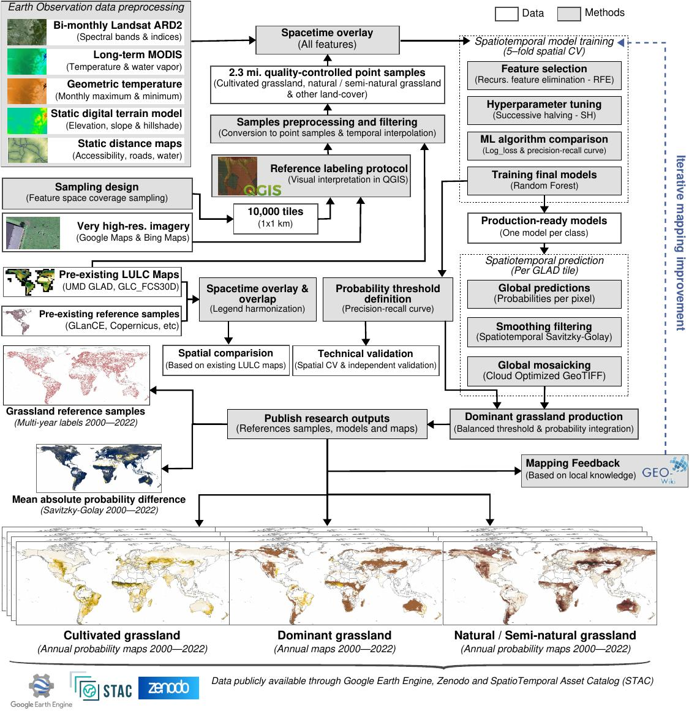

# Global grassland class and extent maps at 30m

This dataset was based on 
* Multiple Earth Observation (EO) data such as [GLAD Landsat ARD-2](https://glad.geog.umd.edu/ard/home), [MOD11A2](https://lpdaac.usgs.gov/products/mod11a2v006/), [MCD19A2](https://lpdaac.usgs.gov/products/mcd19a2v006/), digital terrain model derivatives and distance maps of accessibility, roads, and water;
* For model training, more than 2.3M reference samples were visually interpreted in Very High Resolution (VHR) images using [QGIS Fast Grid Inspection](https://plugins.qgis.org/plugins/qgis-fgi-plugin/#plugin-about);
* Two independent spatiotemporal Random Forest models were used to predict each grassland class (cultivated and natural/semi-natural) over multiple years on a global scale;
* The predictions were produced for all years from 2000 to 2022, resulting in a time series of global probability maps for each class at 30~m spatial resolution. 

The publication describing the scientific methodology is under revision and the source code to implement all these steps is available in workflow.

