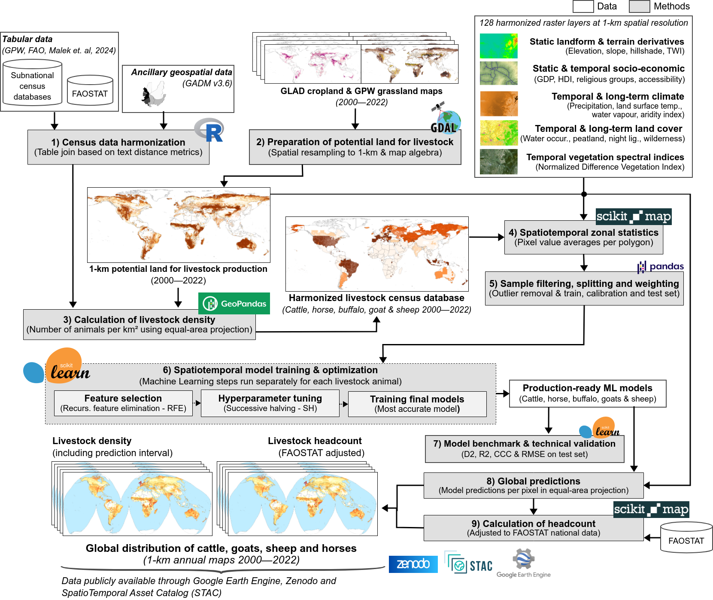

# Global distribution of cattle, goats, sheep and horses at 1-km resolution (2000–2022)

Here you can find an areal regression modeling framework to estimate global livestock densities using subnational census data and spatiotemporal ML. We harmonized the – to our knowledge – largest global collection of [livestock census data comprising 198 countries and 52,883 administrative unit polygons covering (sparsely) 23 years (2000–2022)](https://doi.org/10.5281/zenodo.14926056). Together with an extensive set of environmental, socioeconomic, and anthropogenic gridded/raster layers (comprising 307 individual spatial layers organized as time series of monthly, annual or long-term values), those were used to model global densities of the four livestock animals cattle, goats, sheep and horses. 

To estimate the area under [livestock production](https://doi.org/10.5281/zenodo.14933679), we integrated Landsat-based maps of cultivated and natural/semi-natural grasslands and cropland extent, restricted by limiting land surface temperature, into a time series of potential land for livestock production (2000--2022) at 1-km spatial resolution. The final ML models, selected after a comprehensive model benchmarking, were used to produce annual density maps, including prediction intervals per pixel (lower and upper boundaries around mean predictions). Lastly, the predicted densities were used to derive global headcount maps at the same spatial and temporal resolution, matching with livestock animal numbers provided by FAOSTAT for every country of the World. Census data harmonization was implemented in R and the modeling framework in Python.

