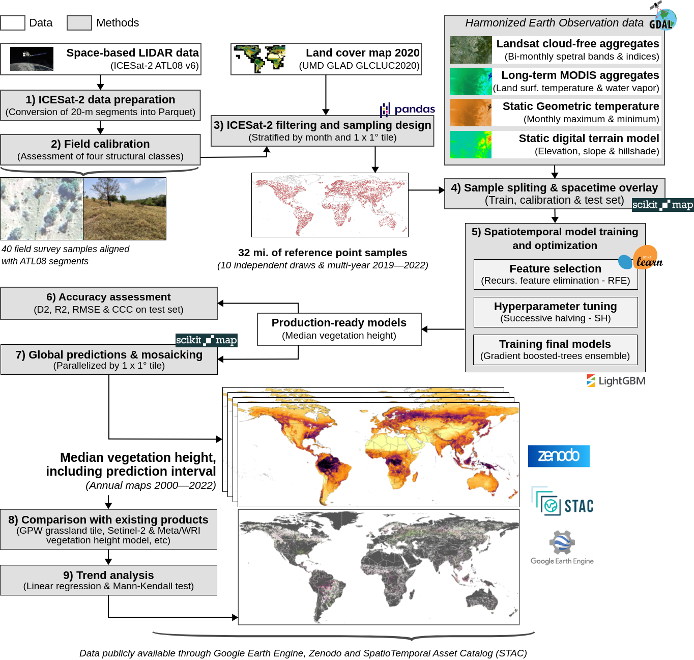

# Global short vegetation height maps at 30-m resolution (2000–2022)

Here you can find an modeling framework to estimate [global median vegetation height](https://doi.org/10.5281/zenodo.15198676) using multi-source Earth Observation (EO) data and spatiotemporal machine learning. The models were trained in ligthgbm using 29M of samples, spacetime overlaid with 153 features (Landsat cloud-free aggregates, MODIS and DTM). 

For each model, Recursive Feature Elimination, Successive Halving hyperparameter tuning and hold-out spatial blocking validation were conducted. The fitted models were compiled to a native C binary using lleaves, reducing the prediction time by factor 5. For all predicted values we derived 90% prediction intervals (percentiles 5th and 95th) and trend analysis (linear regression and Mann-Kendall test). Our model achieves a root mean square error (RMSE) of 2.35 m, R2 values of 0.515 and a D2 regression score of 0.62 estimated via hold-out validation.

